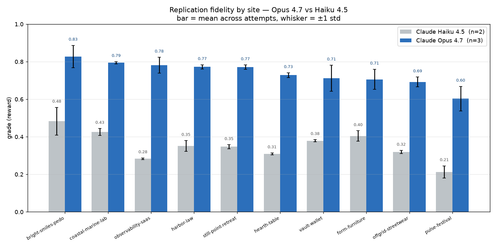
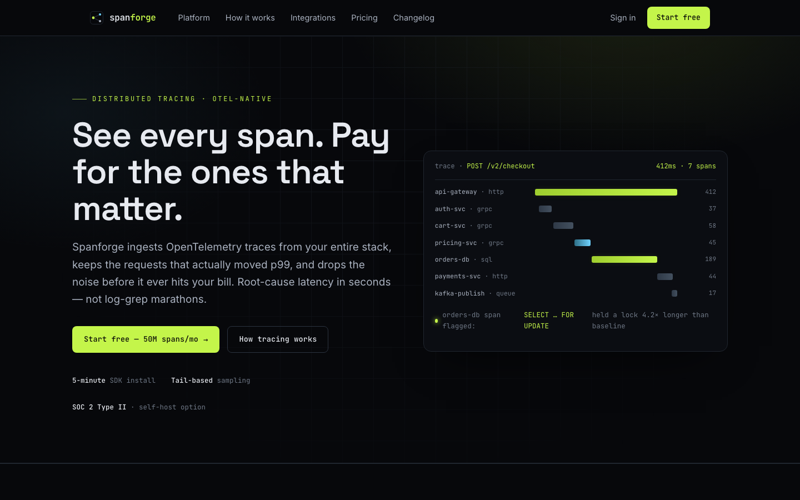
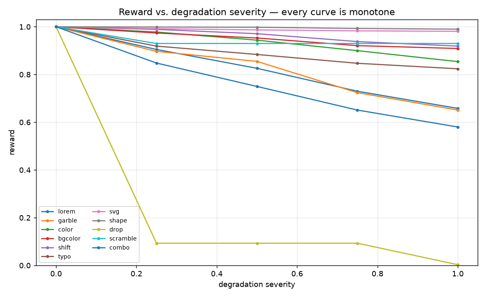
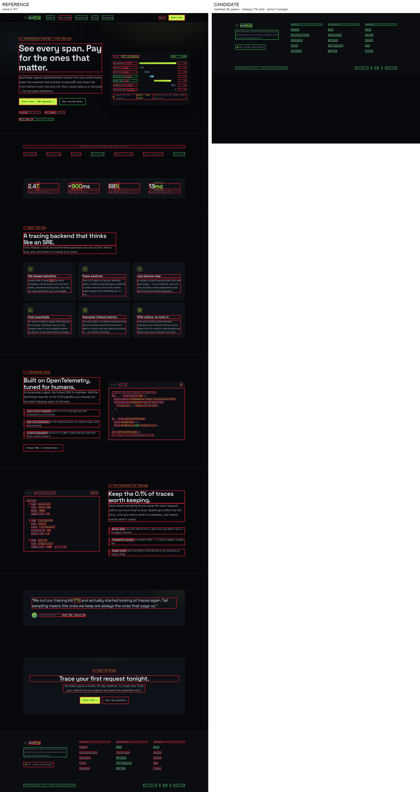
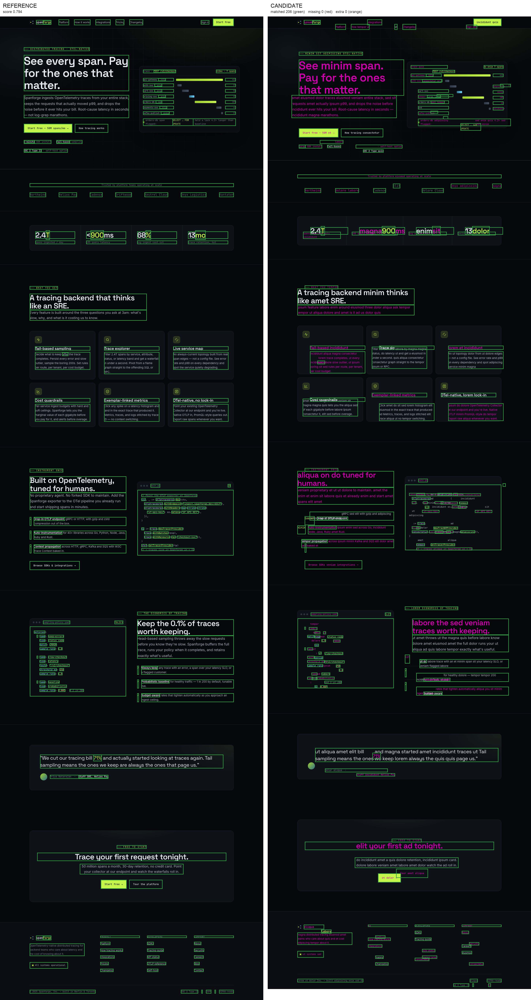
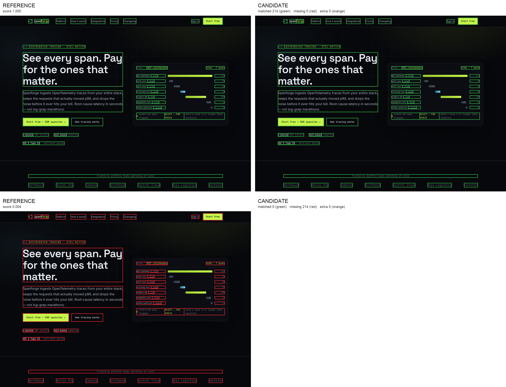
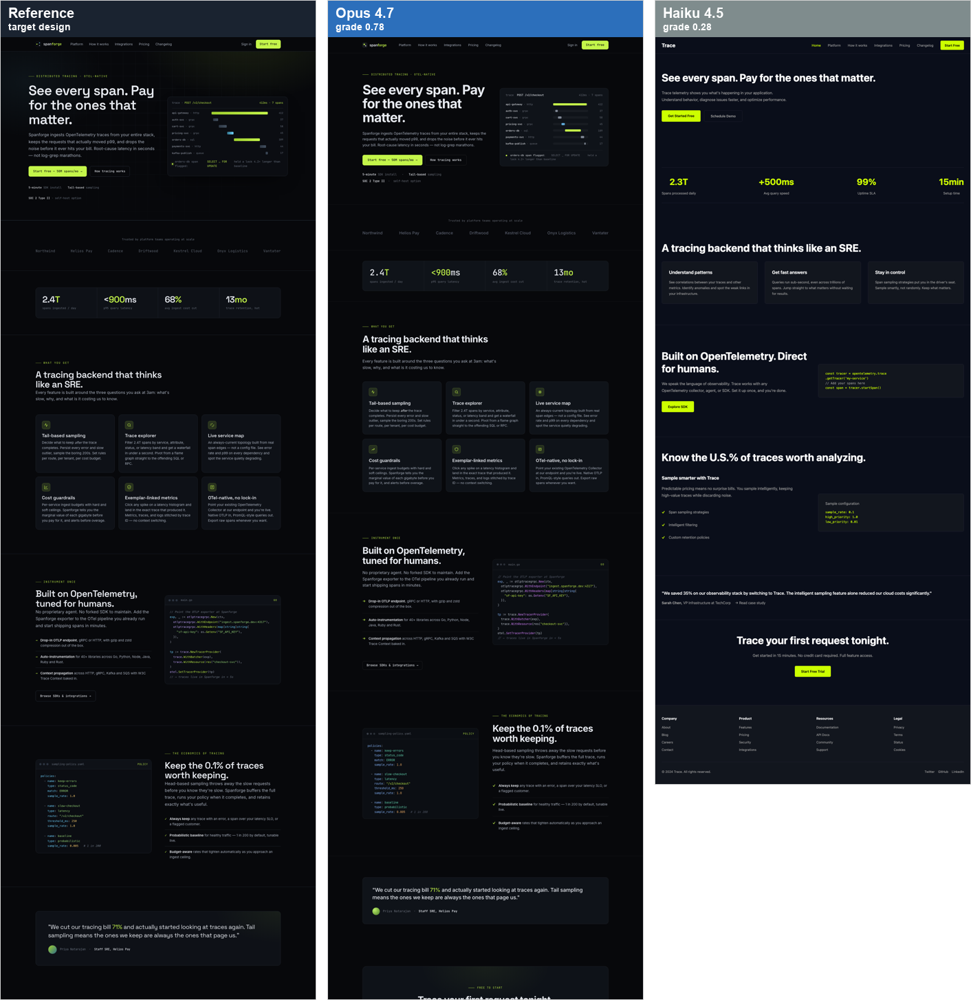
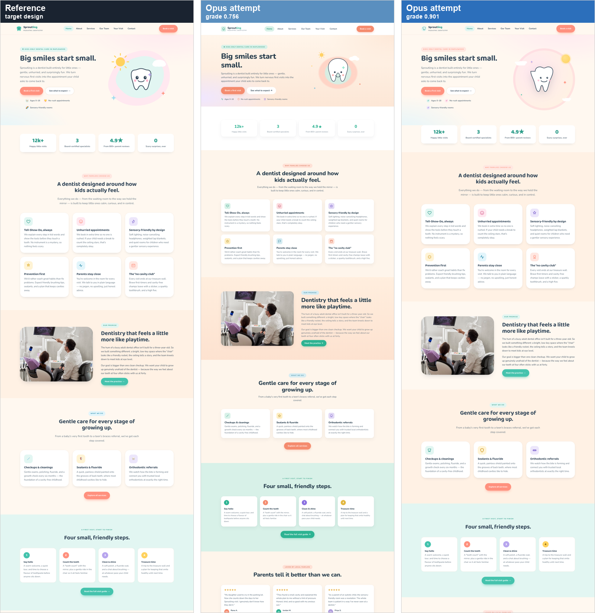
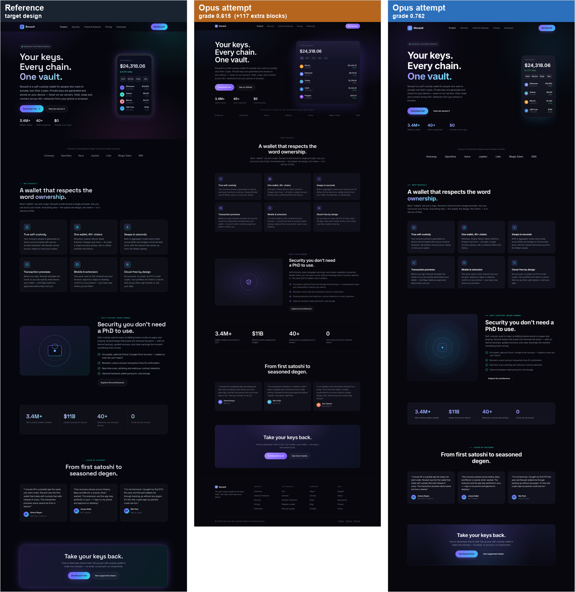

# Design-to-Code: a scalable RL environment recipe for judging website replication

This repository is a **recipe** — an automated pipeline that mass-produces RL environments which test a coding agent's ability to look at a multi-page website and rebuild that design in code. Each generated environment hands the agent screenshots of a site, asks it to replicate the design in HTML + CSS, and then grades how faithfully it did so on a **continuous** scale. It runs on the **Harbor** evaluation framework, executes on **Modal**, and the reference agent we test against is **Claude Code with Opus 4.7**.

This README is the single place where I write down *how I thought about the problem* and *why I made the decisions I made* — not just what the code does. It is meant to be read top to bottom. Where I had a genuine fork in the road, I say what I considered and why I rejected the alternative.

---

## Contents

- [TL;DR](#tldr)
- [How I read the brief](#how-i-read-the-brief)
- [The one decision everything else hangs on](#the-one-decision-everything-else-hangs-on)
- [Architecture: two clocks](#architecture-two-clocks)
  - [The Harbor contract](#the-harbor-contract-what-harbor-actually-does)
  - [Repository layout](#repository-layout)
- [Generating the websites](#generating-the-websites)
  - [Why an agentic generator, not a phased pipeline](#why-an-agentic-generator-not-a-phased-pipeline)
  - [The prompt: soul vs. determinism](#the-prompt-soul-vs-determinism)
  - [Getting a real distribution (the house-style problem)](#getting-a-real-distribution-the-house-style-problem)
  - [The manifest: the contract the rest of the pipeline reads](#the-manifest-the-contract-the-rest-of-the-pipeline-reads)
  - [Reliability: staging, atomic promotion, and a success gate](#reliability-staging-atomic-promotion-and-a-success-gate)
  - [Does it work? A worked example](#does-it-work-a-worked-example)
- [Grading: turning two rendered pages into one number](#grading-turning-two-rendered-pages-into-one-number)
  - [The key decision: grade the rendered DOM, not pixels or code](#the-key-decision-grade-the-rendered-dom-of-both-pages--not-pixels-not-code)
  - [The flow](#the-flow)
  - [The unit: a "block"](#the-unit-a-block)
  - [Matching: text-anchored, position-robust](#matching-text-anchored-position-robust)
  - [The dimensions: what "fidelity" decomposes into](#the-dimensions-what-fidelity-decomposes-into)
  - [The global term: a CLIP story worth telling](#the-global-term-a-clip-story-worth-telling)
  - [Does it work? The validation harness](#does-it-work-the-validation-harness)
  - [Seeing the score: the visualizer](#seeing-the-score-the-visualizer)
  - [Honest limitations](#honest-limitations)
- [Running it for real: 50 rollouts on Modal](#running-it-for-real-50-rollouts-on-modal)
  - [The gap is visible, not just numeric](#the-gap-is-visible-not-just-numeric)
  - [Why one attempt beats another — the grader explains itself](#why-one-attempt-beats-another--the-grader-explains-itself)
  - [Reliability: the same design scores the same](#reliability-the-same-design-scores-the-same)
  - [Operational notes](#operational-notes)
- [Where this goes next: motion (Part 2) and frameworks (Part 3)](#where-this-goes-next-motion-part-2-and-frameworks-part-3)
  - [Part 3 — framework output](#part-3--framework-output-a-small-delta-by-design)
  - [Part 2 — animation fidelity](#part-2--animation-fidelity-the-real-research)
- [Piecing it together: a reward you can train against](#piecing-it-together-a-reward-you-can-train-against)

---

## TL;DR

A pipeline that turns one-line briefs into a **distribution of multi-page websites** (generated from scratch by Opus 4.8), packages each as a self-contained Harbor task, and grades a coding agent's replication of it on a **continuous, deterministic** reward — by rendering both the agent's output and the hidden reference and comparing their **DOMs** across six fidelity dimensions. Prompt in, rollout out, scalar reward back: the exact shape GRPO consumes.

**The grader is validated two ways.** Synthetically: oracle = 1.000, blank page = 0.000, and the reward is **monotone** across all 11 degradation types with **bit-identical determinism**. And on real agents: I ran **50 rollouts on Modal** — all 10 sites, Claude Opus 4.7 (×3) vs Claude Haiku 4.5 (×2).



- **It discriminates.** Opus averaged **0.739**, Haiku **0.351** — and the gap is positive on *every single site* (+0.30 to +0.50), never once overlapping. The reward ranks the stronger agent higher everywhere, not just on average.
- **It's reliable.** Repeat attempts of the same model on the same site land within **~0.01–0.07** of each other — so the within-group ranking GRPO learns from is signal, not noise.
- **It explains itself.** Per-dimension + block-level breakdowns mean every score is attributable (e.g. it caught one Opus attempt that over-generated 117 phantom blocks and ranked it last).

The deep dive lives below — [generation](#generating-the-websites), [grading](#grading-turning-two-rendered-pages-into-one-number), the [full run](#running-it-for-real-50-rollouts-on-modal), and [why it's trainable](#piecing-it-together-a-reward-you-can-train-against). Scaling is three independent knobs: more sites (append to `briefs.json`), more rollouts (Modal concurrency), more capability axes (Parts 2 & 3).

---

## How I read the brief

Before writing anything I read the task description closely, and a few things that are easy to skim past turned out to decide the whole shape of the project. I'm spelling them out because the "decision" here was largely *reading carefully*, and that's worth being honest about.

- **"The agent is given screenshots … to replicate a design."** This is **exact replication**, not "make me a site in this style." It matters because it's the difference between having a ground truth to grade against and not having one (more on this below). I went back and forth on it and the wording — plus the grading requirement — settles it.
- **"You must generate websites from scratch. Do not crawl existing websites."** The constraint is on *me*, the recipe author — not just on the agent. Hand-picking ten real sites and screenshotting them is just crawling moved to authoring time. The parenthetical *"if you decide to use a model provider"* only makes sense if the pipeline itself generates the sites. So the generator **is** the source of the screenshots.
- **"Each website … should have at least 5 pages."** This is a property of the sites *I* generate, not an instruction handed to the agent. The reference site has N≥5 pages; the agent is asked to reproduce exactly those N pages. I never tell the agent "make at least 5 and pick freely" — that would re-introduce the no-ground-truth problem.
- **"Grade … on a spectrum (continuous, not discrete)."** The reward is a float, and higher must mean *a better-looking replica*. The brief is blunt that a bad grader just injects noise and makes the model worse, so the grader is where most of the care goes. The way I'm actually thinking about the bar here: imagine a real model being trained on this environment with an algorithm like GRPO, doing 8–16 rollouts on the *same* task. Each of those rollouts gets graded, and the *relative differences* between those scores are the entire learning signal — GRPO computes an advantage from how each rollout did versus the group, and that's what the gradient is built from. So it's not enough for the grader to be roughly right on average. Within a single task's batch of near-siblings, if replica A scores higher than replica B there has to be a *real, defensible reason* — A genuinely looks closer to the target. If the ordering within that group is noisy, or two visibly-different-quality replicas get the same number, the advantage signal is mush and the model has nothing clean to learn from. That's the standard I hold the grader to: not "is the absolute number sensible" but "does it rank near-siblings the way a careful human would, every time."

---

## The one decision everything else hangs on

**I generated the reference sites from scratch using Opus 4.8, and keep both the rendered screenshots and the source code.** Almost every other good property falls out of this:

1. **It gives the grader a ground truth.** Because I generated the site, I have the exact reference *render* (what it should look like) **and** the exact reference *code* (the DOM/CSS that produced it). The agent gets screenshots, writes code, and I render the agent's code and compare it to my reference. Without a ground truth, "continuous grading" degenerates into an unanchored "is this nice?" judge — exactly the noise the brief warns against.
2. **It actually scales.** "Create tasks at scale" is the literal ask. Curating real sites caps out at whatever I have patience for; a generator makes thousands.
3. **It lets me *engineer* the distribution** instead of hoping a crawl is diverse. I choose the spread across industry, audience, and — critically — *visual style* (see the house-style problem below).
4. **No IP mess, fully self-contained tasks.**

The mirror image of this — the route I **rejected** — is the "style reference" framing: give the agent one image and let it invent five pages. It has no ground truth (every run differs in page count and content), so it can only be graded by a subjective judge with nothing to compare to. That's ungradeable on a stable spectrum, so it's out.

One refinement worth stating, because it shapes the grader later: **the task framing is strict ("replicate exactly"), but the grader's tolerance is not.** A 2px shift or a hair-off colour shouldn't tank a perceptually-perfect replica. Strict target, perceptually-robust measurement.

---

## Architecture: two clocks

The system runs on two separate clocks, and almost all of the design follows from keeping them apart.

```
BUILD TIME  (I run this, once, offline — output is a committed dataset)
  briefs.json
      │  one brief per site (the "what" + a visual direction)
      ▼
  generate ──▶ a multi-page HTML/CSS site on disk + manifest.json
      │
      ▼
  render  ──▶ deterministic full-page screenshots, one per page
      │
      ▼
  emit    ──▶ a Harbor task: instruction + Dockerfile + hidden reference + verifier
                                                   │
                                                   ▼
EVAL TIME   (Harbor runs this, many times, per agent)
  agent (Claude Code / Opus 4.7) reads the screenshots in /app, writes HTML/CSS
      │
      ▼
  verifier (/tests/test.sh): render the agent's output → screenshot →
      grade vs. the hidden reference → write a float to /logs/verifier/reward.txt
```

Why the split matters: if generation happened at eval time, every run would face a *different* site and the reward would be pure noise. The dataset is frozen once and reused, so the only thing that varies between runs is the agent.

### The Harbor contract (what Harbor actually does)

I read Harbor's source rather than guess, because the grader lives or dies on this contract. Harbor's knowledge of "grading" is deliberately tiny — it is a thin orchestrator plus a reward-file reader:

1. It uploads the task's `tests/` directory into the sandbox at `/tests` and runs `/tests/test.sh` (after the agent has finished).
2. It reads `/logs/verifier/reward.txt` (a single float) **or** `/logs/verifier/reward.json` (named floats) and that becomes the trial reward.

That's the entire interface. Everything between "run test.sh" and "a number appears in reward.txt" is **our** code. The canonical Linux paths Harbor hard-codes:


| Path                         | Role                                                              |
| ---------------------------- | ----------------------------------------------------------------- |
| `/app`                       | the agent's working directory (where it writes its HTML/CSS)      |
| `/tests`                     | our verifier directory, uploaded by Harbor *after* the agent runs |
| `/tests/test.sh`             | the entrypoint Harbor executes                                    |
| `/logs/verifier/reward.txt`  | single float — the scalar RL signal                               |
| `/logs/verifier/reward.json` | named floats — useful for a per-component breakdown               |


This is also *why* the recipe and grader are coupled: the hidden reference (reference code + reference screenshots) ships inside the task's `tests/` directory, so it only lands in the sandbox after the agent is gone. The agent can never see it; the verifier always can.

> **Aside.** Because grading is "just a script that writes a float," nothing about Harbor constrains how clever the grader is. All of the research is on our side of that line.

### Repository layout

```
design-to-code/
├── README.md                   ← this file (single source of truth)
├── briefs.json                 ← the seed list: one brief per site (the distribution knob)
├── pyproject.toml · uv.lock    ← deps: anthropic, playwright, torch, open-clip, scipy, pillow
│
├── src/d2c/                    ← the library — every pipeline stage, importable
│   ├── generate/
│   │   ├── prompt.py           ← the static generation prompt (craft + constraints)
│   │   └── builder.py          ← the agentic generation loop (Opus 4.8, write_file/finish tools)
│   ├── render/
│   │   ├── capture.py          ← deterministic full-page screenshots (headless Chromium, 1440px)
│   │   └── freeze.py           ← localise external images, pin animations → self-contained sites
│   ├── grade/                  ← THE GRADER (the core research; vendored into every task)
│   │   ├── introspect.py       ← rendered DOM → list of visible "blocks" + computed styles
│   │   ├── match.py            ← text-anchored, position-robust Hungarian block matching
│   │   ├── color.py            ← LAB ΔE colour distance (gradient-aware)
│   │   ├── embed.py            ← patch-CLIP global term (ViT-B-32)
│   │   ├── score.py            ← six dimensions → weighted page score → site reward
│   │   ├── grade.py            ← top level: grade a candidate site vs. a reference
│   │   ├── verify.py           ← Harbor entrypoint: writes reward.txt + grade.json
│   │   └── visualize.py        ← side-by-side matched/missing/extra overlay
│   └── emit/
│       └── task.py             ← package a generated site into a Harbor task
│
├── scripts/                    ← thin CLI drivers over src/d2c, one per stage
│   ├── generate.py             ← batch generate sites (staging, resume, concurrency)
│   ├── render.py · freeze.py   ← screenshot / freeze every generated site
│   ├── emit.py                 ← build dataset/ tasks from sites/
│   ├── grade.py · visualize.py ← grade / visualise a candidate locally
│   └── figures/                ← build this README's figures (charts + rendered proofs)
│       ├── make_report_images.py
│       └── make_proof_images.py
│
├── tests/                      ← grader validation (free-form, not pytest)
│   ├── degrade.py              ← 11 synthetic degradations at known severities
│   └── validate.py             ← asserts oracle=1.0, floor=0.0, monotonicity, determinism
│
├── configs/                    ← Harbor job configs (Modal backend)
│   ├── modal_smoke.yaml        ← 1 task, Haiku — end-to-end pipeline smoke test
│   ├── modal_opus.yaml         ← 10 tasks × 3 attempts, Claude Opus 4.7
│   └── modal_haiku.yaml        ← 10 tasks × 2 attempts, Claude Haiku 4.5
│
├── sites/<id>/                 ← BUILD-TIME OUTPUT: self-contained site + manifest.json + screenshots
│
├── dataset/<id>/               ← EMITTED HARBOR TASKS (what eval consumes)
│   ├── environment/
│   │   ├── Dockerfile          ← Playwright + torch + CLIP, model pre-baked
│   │   ├── design/             ← the screenshots the agent is given (the target)
│   │   └── assets/             ← image assets the site references
│   ├── instruction.md          ← what the agent is told to build
│   ├── task.toml               ← Harbor task metadata + timeouts
│   └── tests/
│       ├── test.sh             ← Harbor entrypoint (runs the verifier)
│       ├── reference/          ← HIDDEN ground truth (code + manifest) — lands post-agent
│       └── d2c/                ← the grader, vendored so it runs inside the sandbox
│
└── report/                     ← the figures embedded in this README
```

The grader (`src/d2c/grade/`) is a standalone importable library on purpose: it is the one piece of logic shared between build-time self-checks and the eval-time verifier, and `emit` **vendors a copy of it into each task's `tests/d2c/`** so the sandbox can grade without any network or external dependency.

---

## Generating the websites

This is Part 1a: turning a one-line brief into a coherent, human-like, self-contained, ≥5-page website — from scratch.

### Why an agentic generator, not a phased pipeline

My first instinct was a phased pipeline: one call to plan a design system and a sitemap, then a call per page. The problem is **coherence**. If each page is generated by an independent call, the header, nav, footer, and design tokens drift between pages — real sites don't drift, because they share a template. I sketched a workaround (generate the chrome once, inject it into every page), and then realised the workaround was just simulating what an *agent* does for free.

So the generator is an **agent**: Claude (Opus 4.8) with two tools, building the whole site inside one context window. Because it remembers everything it has already written, the nav and design system stay consistent *by construction* — the coherence problem I was engineering around simply doesn't arise. It also self-corrects (write `about.html`, notice the nav needs an entry, go fix `index.html`), which a phased pipeline can't.

> **Aside.** The generator has no idea it's feeding an eval. It thinks it's doing real client work. That separation is deliberate: I want the best site it can make for the brief, not a site contorted for grading.

The two tools it gets — kept deliberately tiny:

```jsonc
// write_file: create/overwrite one text file under the site root
{ "name": "write_file",
  "input_schema": { "type": "object",
    "properties": {
      "path":    { "type": "string" },
      "content": { "type": "string" } },
    "required": ["path", "content"] } }

// finish: called once, last, to terminate the loop
{ "name": "finish",
  "input_schema": { "type": "object",
    "properties": { "summary": { "type": "string" } },
    "required": ["summary"] } }
```

`write_file` is text-only by design — HTML, CSS, SVG. There is no binary-asset tool, which (as it happens) nudges the model toward inline SVG and CSS for imagery, which is great for determinism. `finish` is purely a clean termination signal; whether the site is actually *acceptable* is decided by my own gate, not by trusting the model's word.

I considered having the model return all files as one JSON object (`{"files": [...]}`) and rejected it: escaping 15k-token HTML blobs inside JSON is exactly where a model drops a quote and the whole parse dies. One file per tool call sidesteps escaping entirely.

### The prompt: soul vs. determinism

The generation prompt (`src/d2c/generate/prompt.py`) is where craft and constraints live. The hardest tension was **stability vs. soul**. My first draft banned all external resources for reproducibility — and would have produced soulless sites. That was the wrong rule. The right rule is narrower:

> **The same input must always render to the same pixels.**

Through that lens:

- **Google Fonts and icon CDNs are allowed.** They're versioned and stable, so render-determinism holds as long as the render environment is fixed and we wait for `document.fonts.ready` before screenshotting (the one real footgun — a flash of unstyled text — is solved at capture time, not by crippling the prompt).
- **Images must use stable sources** — inline SVG, CSS gradients, or a fixed image URL — never a random/cache-busting endpoint like `source.unsplash.com/random`, which would make the reference itself non-reproducible.
- **No clock, no randomness, no content that changes between loads.**

The prompt also makes cross-page coherence a hard requirement (same chrome, one palette, one type scale), demands real written copy (no lorem ipsum), tells the model the exact viewport width it will be captured at (1440px), and ends by requiring a `manifest.json` (schema below) before `finish`.

#### A note on images (a real bug we caught, and how I handled it)

Some lanes are photo-heavy (the restaurant uses 31 images), and the model sources them from Unsplash. Two things surfaced here that are worth being honest about.

**The agent can't reproduce a photo from a screenshot.** It never has the original file, so a photographic region can't pixel-match. My resolution is the one we settled on above: **the frozen image assets are handed to the agent as part of the task.** This mirrors a real design-to-code/Figma handoff (you get the assets), and it keeps the task about *design* — layout, spacing, type, colour, and correct image *placement* (size, crop, `object-fit`, radius) — rather than testing whether the agent can hunt down a matching stock photo. The grader can then compare the full page cleanly, with no special-casing of image regions.

**The model hallucinates image URLs.** When I built the asset-localising step ("freeze"), ~1 image per photo-heavy site returned a 404: the model had written a plausible-looking `images.unsplash.com/photo-<id>` URL for a photo that doesn't exist. It can't fetch or verify images at generation time, so some URLs are simply invented. At render time these had failed *silently* (a blank image on an otherwise-fine page), so the success gate never caught them — a reference with a missing hero is a poisoned grading target.

I fixed it at the pipeline level rather than the source: the freeze step downloads every external image into the site's own `assets/` folder, relinks the HTML/CSS to local paths, and **substitutes any unreachable URL with a valid image harvested from the sites that did download** (deterministically chosen, so it's stable). After freezing, every site is fully self-contained — it renders identically, offline, forever, with no CDN dependency. That last property also matters for grading: the eval-time verifier renders the reference *code* inside a (typically network-restricted) sandbox, and frozen assets let it do so offline.

> **Aside — what I'd do given more time.** The clean fixes for the hallucination live at generation time: either have the generator *verify* each image URL resolves before using it (and retry/replace on a 404), or drop external raster images entirely and require self-contained SVG/CSS imagery (the four SVG-only sites prove the model is more than good enough at this). Both are better than patching after the fact. I went with the pipeline-level fix for now purely on time grounds, and I'm flagging it rather than hiding it — the substitution is a band-aid on a generation-quality issue, not a real solution.

### Getting a real distribution (the house-style problem)

The brief asks for "a good distribution of websites." The threat to that is subtle and worth calling out: **Opus has a documented default aesthetic** — warm cream backgrounds, serif display faces, terracotta accents, editorial layouts. If my briefs only specify *what* a site is for and leave the *look* free, a big fraction of them converge on that one style and the distribution collapses visually even when the industries differ.

So each brief carries a deliberate **visual direction** alongside the domain and audience. The brief stays the "what," but it names an aesthetic lane to force spread and break the bias. Here is the spread it produces:


The ten lanes:


| id                    | domain                     | visual direction                          |
| --------------------- | -------------------------- | ----------------------------------------- |
| `observability-saas`  | dev observability platform | dark, technical, dense, monospaced accent |
| `harbor-law`          | corporate law firm         | conservative serif, navy/gold, formal     |
| `pulse-festival`      | indie music festival       | maximalist, vivid, oversized type         |
| `bright-smiles-pedo`  | pediatric dental clinic    | friendly, rounded, pastel, illustrative   |
| `form-furniture`      | modernist furniture brand  | minimal, monochrome, whitespace           |
| `hearth-table`        | farm-to-table restaurant   | warm, rustic, photography-led             |
| `vault-wallet`        | crypto wallet              | sleek, dark, gradient, glassy             |
| `coastal-marine-lab`  | university research lab    | utilitarian, dense, classic-academic      |
| `still-point-retreat` | yoga/wellness retreat      | calm, airy, soft neutrals                 |
| `offgrid-streetwear`  | streetwear brand           | brutalist, high-contrast, grid-breaking   |


Full per-page screenshots for each site live under [`dataset/<id>/environment/design/`](dataset/).

A brief is a small JSON object — `id` doubles as the output directory name and the eventual Harbor task name:

```json
{ "id": "observability-saas",
  "brief": "A B2B SaaS platform ... Lean into a dark, technical aesthetic with a
            tight monospaced accent font, dense data-feeling layouts, code
            snippets, and a restrained neon accent on near-black surfaces." }
```

> **Aside — scaling this.** Because generation is decoupled from everything downstream and seeded by a flat list, scaling to *N* sites is "append more lines to `briefs.json`." The distribution is literally a knob. Ten is enough to show the spread for this trial; the machinery doesn't care if it's ten or ten thousand.

### The manifest: the contract the rest of the pipeline reads

The agent must write a `manifest.json` before finishing. This is the keystone that lets the render and emit stages stay dumb — they consume *only* the manifest, never the model's prose. Its shape:

```json
{
  "summary": "<one sentence describing the finished site>",
  "design_system": {
    "style_descriptors": ["editorial", "warm", "serif-led"],
    "palette": ["#..."],
    "fonts": ["Fraunces", "Inter"]
  },
  "entry": "index.html",
  "pages": [
    { "path": "index.html", "title": "Home", "purpose": "..." }
  ]
}
```

`pages[]` is what the render stage iterates to screenshot each page in a stable order; `entry` is where the agent's instruction will point; `design_system` and `summary` feed distribution analysis and the eventual task instruction. Without this list there's nothing to enumerate — it's the answer to "how do we know what to screenshot."

### Reliability: staging, atomic promotion, and a success gate

Agentic output is *variable* — which is fine, because generation runs once and the result is frozen, but only if I gate on quality. Two mechanisms make the batch driver (`scripts/generate.py`) robust:

- **Crash-proof resume via staging + atomic rename.** Each site is built into `sites/.staging/<id>/`, and only on success is it `os.replace()`-d (an atomic rename) into `sites/<id>/`. A finished `sites/<id>` can therefore *only* exist via a completed promotion — there is no half-written state to misjudge. The resume rule falls out of one invariant: `sites/<id>` exists ⇒ skip; anything in `.staging` is leftover from a crash and gets wiped before retry. This is exactly the behaviour I wanted — "skip what's done, never skip a partial" — from a single guarantee rather than a pile of special cases.
- **A success gate.** Before promotion a site must pass: the model called `finish`, `manifest.json` parses, and there are ≥5 HTML pages on disk. Fail any and the staging dir is deleted and the site reports `FAILED`. Each site is generated in its own thread (the loop is I/O-bound on the API), so one bad brief never takes down the batch, and re-running the command retries only the missing ones.

Every promoted site also carries a `generation.json` (brief, model, effort, step count, file list) — a cheap audit trail for "how was this task made."

### Does it work? A worked example

The first site I generated was `observability-saas` — deliberately the lane *furthest* from Opus's house style, to test whether the visual-direction lever actually steers the model. It finished in 9 steps with 6 pages. Here is its home page, above the fold:



And the manifest it wrote:

```json
{
  "summary": "Spanforge is a dark, terminal-flavoured marketing site for an
              OpenTelemetry-native distributed tracing platform aimed at staff
              engineers and SREs ... with a restrained signal-lime accent.",
  "design_system": {
    "style_descriptors": ["dark", "technical", "dense", "monospaced-accent"],
    "palette": ["#07080b", "#0e1117", "#181d27", "#e7eaf0", "#c4f54a", "#6fd3ff"],
    "fonts": ["Space Grotesk", "Inter", "JetBrains Mono"]
  },
  "entry": "index.html",
  "pages": [ "index", "platform", "how-it-works", "integrations", "pricing", "changelog" ]
}
```

Auditing the output confirmed the properties the rest of the pipeline depends on:

- **Self-contained & deterministic.** The *only* external resource across all seven files is Google Fonts. **Zero `` tags, zero external images, zero JavaScript.** Every visual is inline SVG (8–9 on the hero/platform pages) plus 14 CSS gradients. It renders identically every load.
- **Coherent.** Shared header with a consistent SVG brand mark; all six pages cross-linked in every nav/footer; one shared 21KB `styles.css`.
- **Substantive.** 12–19KB of real markup per page, a real product name, proper meta descriptions, semantic landmarks and ARIA.
- **On-brief.** Near-black `#07080b` canvas, JetBrains Mono, lime/cyan accents. Nothing cream, nothing serif. The brief's visual direction overrode the model's default — which is the evidence that the distribution strategy holds.

---

## Grading: turning two rendered pages into one number

This is the part I spent the most care on. The reward *is* the entire learning signal — a noisy or badly-ranked reward trains a model to be **worse**, not better. So the bar isn't "is the score roughly sensible." It's the GRPO bar from the top of this doc: **within a group of rollouts on the same task, a replica that looks closer to the target must score higher than one that looks worse — every time, deterministically.**

### The key decision: grade the rendered DOM of *both* pages — not pixels, not code

The reference design I started from assumed a screenshot-only world and reached for pixel methods (perceptual hash, OCR, whole-image CLIP). Two earlier decisions let me do something sharper:

1. We **render both** the reference and the candidate in the **same environment**, so the cross-machine font/anti-aliasing noise that usually makes people avoid pixel comparison simply disappears. A font difference between candidate and reference becomes *signal*, not noise.
2. We **generated** the sites, so the reference is something we can render and introspect — which means we can read the **rendered DOM + computed styles** of *both* pages: exact text, exact colours, exact font sizes, exact boxes. No OCR error, no estimation.

So the grader **renders both pages and compares their rendered DOMs**, with one firm rule: **grade the render, never the code.** Two different implementations (HTML/CSS, or React, or Solid) that render identically must both score 1.0 — visual fidelity is the goal, not markup similarity. This is also why the approach is framework-agnostic (Part 3 comes almost for free: everything renders to a DOM) and why it **generalizes beyond our generated sites** — any renderable reference, including a real crawled website, has a DOM. Our generated reference just happens to be the one we own. (The pure pixel/OCR approach stays a documented fallback for the one situation we don't face: a reference you can only see as an image and cannot render.)

> **Aside — this is what makes the pipeline scalable.** The agent under test only ever sees screenshots (no code), so at inference time it behaves exactly like a real screenshot-to-code task. The grader uses the code purely as a reliable, renderable ground truth. Because the generator produces unlimited renderable references, the RL pipeline scales without bound — and doubles as a synthetic-data engine for design-to-code.

### The flow

```
reference site ─┐
                ├─ render both (same headless Chromium, 1440px, fonts loaded, frozen)
candidate site ─┘
        │
        ▼  introspect each rendered DOM
   blocks: [{kind, text/img/svg, box, color, background, font*, border*, ...}]
        │
        ▼  match reference blocks ↔ candidate blocks  (text-anchored Hungarian)
   matched / missing / extra
        │
        ▼  score each matched block on 5 DOM dimensions + a patch-CLIP global term
   layout · content · color · typography · shape · global
        │
        ▼  weighted page score  →  mean − λ·std across pages
   /logs/verifier/reward.txt (scalar Harbor reads)  +  grade.json (per-dimension breakdown)
```

Every step is **deterministic** — rendering, DOM extraction, colour math, Hungarian matching, CLIP. No LLM anywhere in the reward path. That's deliberate: identical rollouts get identical scores (zero spurious variance), so any score difference between rollouts reflects a *real* difference — the cleanest possible GRPO signal. (An LLM-as-judge primary grader cannot have this property; it's the single biggest reason we don't use one.)

### The unit: a "block"

Introspection walks each rendered DOM and emits one entry per visible atomic element — a text leaf, an image, or an inline SVG / background-image graphic — carrying everything we grade:

```jsonc
{ "kind": "text" | "image" | "graphic",
  "text": "Big smiles start small.",          // exact, from the DOM (no OCR)
  "imgKey": "ab12cd.jpg", "childCount": 7,     // image identity / SVG complexity
  "x": 220, "y": 410, "w": 540, "h": 72,       // document-space box
  "color": "rgb(...)", "background": "...",     // text colour + effective bg (solid or gradient)
  "fontFamily": "...", "fontSize": 48, "fontWeight": "700",
  "fontStyle": "...", "textAlign": "...", "textTransform": "...", "lineHeight": 56,
  "borderRadius": 12, "borderWidth": 1, "boxShadow": "..." }
```

(The observability-saas home page yields ~214 such blocks.)

### Matching: text-anchored, position-robust

Before we can compare, we have to decide which candidate block *is* which reference block. We build a cost matrix and solve a Hungarian assignment, with `cost = 0.5·(1 − contentSimilarity) + 0.5·positionDistance` and a cutoff above which a pair is rejected. Whatever's left over answers "same / missing / new":

- **matched** → a reference block paired with a candidate block (then scored).
- **missing** → a reference block with no partner (the agent didn't reproduce it).
- **extra** → a candidate block with no partner (the agent added clutter).


| Reference block           | Candidate block                | Outcome                                                                |
| ------------------------- | ------------------------------ | ---------------------------------------------------------------------- |
| "Big smiles start small." | "Big smiles start small."      | **matched** → scored on size/colour/position                           |
| hero image `ab12.jpg`     | uses `assets/ab12.jpg`         | **matched** (image identity)                                           |
| "Book a first visit"      | same, shifted 40px down        | **matched** → small `layout` penalty, *not* a missing+extra double-hit |
| "Sensory-friendly rooms"  | *(absent)*                     | **missing** → 0, drags coverage down                                   |
| *(absent)*                | "Subscribe to our newsletter!" | **extra** → clutter penalty                                            |


The 50/50 text/position blend is deliberate and is what makes the grader **robust to chaos**: a block whose text is *completely garbled* but stayed in place still **matches** (position carries it) and is scored as "right place, wrong content" — instead of churning into a missing+extra pair. That's why the harshest synthetic degradation (`garble`, whole blocks randomized) still produces a *smooth, monotone* reward. Match robustly; score strictly — two separate jobs.

### The dimensions: what "fidelity" decomposes into

Each matched block contributes to a set of orthogonal, individually-interpretable dimensions. A *missing* block scores 0 on each — so coverage is baked in for free (the denominator is always the reference's block count).


| Dimension      | Weight | Tier       | What it measures (from computed styles)                                    |
| -------------- | ------ | ---------- | -------------------------------------------------------------------------- |
| **layout**     | 0.20   | structural | position + box size (+ a page-height term)                                 |
| **content**    | 0.20   | structural | text similarity / image identity / SVG complexity                          |
| **global**     | 0.20   | holistic   | patch-CLIP perceptual similarity (below)                                   |
| **color**      | 0.15   | surface    | text colour **and** effective background (gradient-aware), ΔE in LAB       |
| **typography** | 0.15   | surface    | font size, family, weight, italic, text-align, text-transform, line-height |
| **shape**      | 0.10   | detail     | border-radius, border width, box-shadow                                    |


plus a **clutter penalty** for extra blocks and a **cross-page consistency penalty** (`mean − 0.5·std`) so nailing four pages and bombing one loses to a steady result. The breakdown lands in `reward.json`, making the reward interpretable ("this model is consistently weak on typography") and hard to game (you can't inflate one dimension without the others exposing the gap).

A note on those weights, because false precision would be easy here: they encode a **priority ordering** (structural ≈ holistic > surface > detail), not measured constants — there's no experiment that says layout deserves *exactly* more than colour. Crucially, **monotonicity does not depend on the exact weights**: every dimension is independently monotone in degradation, and a non-negative combination of monotone-decreasing curves is still monotone-decreasing. So the reward is "higher == better" for *any* sane weighting; the weights only tune the relative *emphasis* between failure types, not correctness. Pinning them down more precisely would mean fitting to human preference rankings — the right next calibration step, and noted as future work rather than faked here.

### The global term: a CLIP story worth telling

The DOM dimensions are precise but blind to a few things — overall gestalt, gradients, spacing rhythm, decorative SVG *appearance*. CLIP fills that gap. But getting it right took two iterations, and it's the most interesting finding in the grader.

**Whole-page CLIP was deterministic but *non-monotone*.** Feeding a full ~1440×4000px screenshot into CLIP's 224px input squishes away ~95% of the detail. The result is a stable number of the *wrong quantity*: degrading a page *more* sometimes scored it *higher* (on the lorem sweep, the 50%-garbled page scored above the 25% one), and it went completely *blind* to removing every icon (svg global stayed a flat 1.000). Determinism ≠ monotonicity — and GRPO needs both.

**Patch-CLIP fixed it.** Instead of one squished embedding, tile both renders into a normalized grid (~700px cells → ~3× downscale instead of ~18×), batch-embed every cell in a single forward pass, and average the per-cell calibrated cosines (skipping cells blank in both). This made the global term **monotone and far more discriminative**, and it now notices icon removal and section reordering that whole-page CLIP missed:


| `global` curve (severity 0→1) | whole-page CLIP                                  | **patch-CLIP**              |
| ----------------------------- | ------------------------------------------------ | --------------------------- |
| `lorem`                       | 1.0, 0.84, 0.78, 0.66, 0.64                      | 1.0, 0.71, 0.52, 0.42, 0.34 |
| `typo`                        | 1.0, 0.72, **0.90**, 0.83, 0.54 (↑ non-monotone) | 1.0, 0.74, 0.62, 0.50, 0.44 |
| `svg` (icon removal)          | 1.0, 1.0, 1.0, 1.0, 1.0 (**blind**)              | now responds                |


Once patch-CLIP was reliable, I raised its weight from 0.10 (a conservative cap from when it was the *noisy* signal) to **0.20**. That made the grader correctly penalize section reordering that the position-normalized DOM dimensions under-detect (`scramble` 0.961 → 0.930) — with every kind still monotone. The DOM dimensions stay collectively dominant (0.80), so the precise signals remain in charge while CLIP handles the holistic gestalt.

### Does it work? The validation harness

I treated validation as a first-class deliverable, not an afterthought. The free-form harness in `tests/` builds **synthetic degradations** of a reference at known severities and checks the properties that make the reward trustworthy. The degradations are deliberately *not* gentle — they include `garble` (whole blocks randomized), `combo` (text + colour + shift at once), and `drop` (whole sections removed) — because a real agent can fail in any of these ways and the grader has to stay reliable through all of them.

**Oracle = 1.0, floor = 0.0.** The reference graded against itself scores a perfect 1.0 on every dimension; a blank page scores 0.0. Both anchors are exact.

**Monotone across all 11 degradations**, and each one drives down *its own* dimension — evidence the dimensions are orthogonal:

```
kind      s=0.0   0.25    0.5     0.75    1.0     monotone   target dim @ 1.0
lorem     1.000   0.905   0.826   0.730   0.658   PASS       content 0.304
garble    1.000   0.897   0.855   0.724   0.651   PASS       content 0.299
color     1.000   0.978   0.944   0.900   0.854   PASS       color   0.500
bgcolor   1.000   0.974   0.953   0.921   0.909   PASS       color   0.631
shift     1.000   0.989   0.971   0.938   0.919   PASS       layout  0.983
typo      1.000   0.919   0.884   0.847   0.824   PASS       typo    0.613
svg       1.000   0.992   0.987   0.983   0.981   PASS       content 0.963
shape     1.000   0.999   0.998   0.993   0.990   PASS       shape   0.988
drop      1.000   0.093   0.093   0.093   0.003   PASS       content 0.000
scramble  1.000   0.930   0.930   0.930   0.930   PASS       layout  0.976
combo     1.000   0.848   0.750   0.651   0.580   PASS       content 0.312
```

**Deterministic** — grading the same render twice returns the identical float to six decimal places.



*Every degradation drives the reward monotonically down. `drop` cliffs (removing whole sections is catastrophic); subtle single-attribute degradations slope gently; nothing ever ticks back up.*

### Seeing the score: the visualizer

Numbers are abstract, so the grader can also render a side-by-side overlay: reference on the left, candidate on the right, **green** for matched blocks, **red** for reference blocks the candidate is *missing*, **orange** for *extra* candidate blocks, with the score breakdown in the header.

A candidate that dropped most of its sections — the reference lights up red and the score crashes to ~0.11:



A `combo` degradation (wrong colours + shifts + garbled text) — every block still matches (green), but the score reflects the damage:



And the two sanity anchors — the reference graded against *itself* (all green, score 1.000) above a blank page (all red, score 0.000):



### Honest limitations

- Monotonicity is proven on single-axis and compound *synthetic* degradations. For *arbitrary* agent output, two wildly different failures may not be cleanly orderable — but the grader stays deterministic, bounded, and each dimension tracks its own property.
- Patch-CLIP is mildly sensitive to large vertical shifts (content crossing cell borders); bounded by its 0.20 weight and the shift-robust DOM matching.
- `shape`/`svg` magnitudes scale with how much a site uses styling/graphics, so on minimalist sites they move little — correct, but less discriminative there.
- We deliberately skipped `letter-spacing` and fine-grained padding — largely proxied by line-height/position/size, and adding them risked penalizing sub-pixel noise, which would work against the low-noise goal.

## Running it for real: 50 rollouts on Modal

The validation harness above proves the grader behaves on *synthetic* damage. But the question that actually matters for training is different: when two real coding agents of genuinely different strength attempt the same designs, does the reward separate them cleanly, rank their attempts the way a careful human would, and stay quiet when nothing changed? So I ran the whole recipe end-to-end on [Modal](https://modal.com): all ten sites, against two models of deliberately different capability — **Claude Opus 4.7** (3 attempts per site) and **Claude Haiku 4.5** (2 attempts per site). That's **50 independent rollouts**, each one a full loop: Harbor builds the task container, hands the agent the screenshots, the agent writes HTML + CSS from scratch, we render its output and grade it against the reference DOM. Nothing about the two models is told to the grader; it only ever sees rendered pages.

If the reward is real, two things have to fall out of this with no further tuning: a **large, consistent gap** between the strong and weak model on every site (discrimination), and **tight clustering** between repeat attempts of the same model on the same site (reliability). Both did.


*Each pair is one site: grey is Haiku, blue is Opus; bar height is the mean grade across attempts, the whisker is ±1 std. Sorted by Opus mean. Opus wins every single site, and the whiskers are short — the grader gives the same design from the same model nearly the same score every time.*

Here is the same data exactly, since a chart hides the decimals:

```
site                  Opus 4.7 mean (sd)   Haiku 4.5 mean (sd)    gap
--------------------  ------------------   -------------------   ------
bright-smiles-pedo       0.828 (0.059)        0.483 (0.074)      +0.345
coastal-marine-lab       0.794 (0.006)        0.425 (0.019)      +0.369
observability-saas       0.781 (0.042)        0.283 (0.004)      +0.498
harbor-law               0.773 (0.011)        0.351 (0.029)      +0.422
still-point-retreat      0.771 (0.012)        0.347 (0.010)      +0.424
hearth-table             0.728 (0.012)        0.309 (0.004)      +0.419
vault-wallet             0.712 (0.069)        0.379 (0.005)      +0.333
form-furniture           0.706 (0.054)        0.404 (0.028)      +0.302
offgrid-streetwear       0.692 (0.026)        0.319 (0.008)      +0.373
pulse-festival           0.603 (0.065)        0.213 (0.033)      +0.391
--------------------  ------------------   -------------------   ------
OVERALL                  0.739                0.351              +0.388
```

The gap is positive and wide on all ten sites — it never once comes close to overlapping. Opus averages **0.739**, Haiku **0.351**: the stronger model scores roughly twice as high, and it does so whether the site is a dark dev-tools page or a pastel pediatric-dentist site. A reward that only separated models *on average* would be useless for per-rollout training; this one separates them *per site*, which is what GRPO actually consumes.

### The gap is visible, not just numeric

The numbers line up with what you see. Below is the `observability-saas` home page: the reference on the left, Opus's replica (0.78) in the middle, Haiku's (0.28) on the right. Opus reproduces the near-black canvas, the card grid, the type — Haiku drops the dark theme entirely and renders a pale, sparse approximation. The 0.50 score gap is not a grader artifact; it is the difference between these two pictures.



### Why one attempt beats another — the grader explains itself

The most useful property for training isn't the model gap; it's whether the reward **orders sibling attempts correctly** — because that within-group ranking *is* the GRPO learning signal. Three sites are worth opening up, because the per-dimension breakdown the grader records lets it explain its own scores.

**A clean monotone climb — `bright-smiles-pedo` (0.756 → 0.825 → 0.901).** Opus's three attempts on this site span 0.15 of reward, and every lever moves in the same direction as the score:

```
reward   layout content color  typo  shape global | matched missing extra
------   ------ ------- -----  ----  ----- ------ | ------- ------- -----
0.756     0.87    0.93   0.72  0.81   0.95   0.55 |   601      28     30
0.825     0.93    0.80   0.92  0.96   0.97   0.71 |   613      16     30
0.901     0.96    0.95   0.95  0.98   0.98   0.76 |   616      13     18
```

As the reward rises, matched blocks go up (601 → 616), missing blocks fall (28 → 13), spurious extras fall (30 → 18), and color (0.72 → 0.95) and global layout (0.55 → 0.76) sharpen. The lowest attempt lost points specifically on color and holistic structure — and you can see it: its hero is flatter, its sections looser.



**An outlier the grader caught — `vault-wallet` (0.615 vs 0.760, 0.762).** Two of the three attempts are near-identical (0.760, 0.762); one sits well below at 0.615. The breakdown says exactly why:

```
reward   layout content color  typo  shape global | matched missing extra
------   ------ ------- -----  ----  ----- ------ | ------- ------- -----
0.615     0.78    0.69   0.50  0.82   0.88   0.51 |   597      67    117   <- over-generated
0.760     0.84    0.87   0.60  0.84   0.88   0.65 |   591      73      8
0.762     0.87    0.90   0.59  0.84   0.91   0.68 |   607      57     37
```

The low attempt emitted **117 extra blocks** — content that doesn't exist in the reference — and matched the real content less faithfully (content 0.69, global 0.51). It looks plausible at a glance, but the grader measured the clutter and the weaker structural match and ranked it last. That's the behavior you want: a reward that isn't fooled by "produced lots of stuff," only by "produced the *right* stuff."



**The hardest site — `pulse-festival` (0.512 → 0.639 → 0.659).** This is Opus's lowest-scoring site, and the reason is legible: it's a maximalist, vivid festival design, and `color` is the dimension that stays stubbornly low across all three attempts (0.31 → 0.40 → 0.54). The grader isn't confused by the site — it's correctly reporting that *matching saturated, oversized, layered color is genuinely hard*, and that the better attempts are the ones that got closer.

```
reward   layout content color  typo  shape global | matched missing extra
------   ------ ------- -----  ----  ----- ------ | ------- ------- -----
0.512     0.77    0.55   0.31  0.68   0.90   0.19 |   939      38     35
0.639     0.84    0.75   0.40  0.75   0.94   0.37 |   948      29      3
0.659     0.86    0.85   0.54  0.69   0.96   0.34 |   957      20     15
```

Across every site, the same pattern holds: **higher reward tracks more matched blocks, fewer missing, fewer hallucinated extras, and higher per-dimension fidelity.** The variance between attempts isn't grader noise — it's real differences in what the agent built, ordered correctly. Two dimensions are consistently the hardest to max out — **color** and **global** — which matches the synthetic findings and is honest: exact color and whole-page composition are the last things a replica gets right.

### Reliability: the same design scores the same

The whiskers on the chart are the headline reliability result, but stated plainly: across all ten sites, the standard deviation between Haiku's two attempts is **0.004–0.074** — often under one reward point in a hundred. Opus is similar (0.006–0.069), with its wider cases (`vault-wallet`, `bright-smiles`) being exactly the ones where, as shown above, the attempts were *genuinely* different in quality. A grader that returned noisy scores for identical-quality work would poison GRPO's advantage estimates; this one is steady enough that the within-group ranking is defensible.

And it's steady *across environments*, not just across repeats: `observability-saas` scored **0.828** in an earlier local Docker run and **0.781 ± 0.04** here on Modal — the same answer from different infrastructure, which is what determinism by construction (frozen animations, fixed viewport, no network in the grader) buys you.

### Operational notes

- **49 of 50 rollouts completed cleanly.** One Opus attempt (`offgrid-streetwear`) hit the 30-minute agent cap and was flagged — it still produced a valid graded render (0.729, in line with its siblings), but it's excluded from the official mean. Every other agent finished on its own in 9–20 minutes; the 30-minute ceiling is a safety net we touched once, not a guillotine.
- **No grading failures, ever.** All 50 renders graded; zero verifier errors, zero non-determinism.
- **Cost, for calibration:** the Opus run (30 rollouts, ~1M-token context with full-page screenshots) was ≈ $221; the Haiku run (20 rollouts) ≈ $7. Compute lives on Modal, so concurrency is a config knob, not a function of the laptop.

## Where this goes next: motion (Part 2) and frameworks (Part 3)

A deliberate scope note. The brief sketched three parts — static replication, animation, and framework output — and was explicit that one part done well beats three done in a hurry. So I spent the time going deep on Part 1: a generator that produces a real distribution, a grader whose every property is argued and validated, and a 50-rollout run that shows the reward discriminates and is reliable on real agents. The two remaining parts are design problems I'd rather specify carefully than rush into code, and the architecture was built to absorb both. Here is exactly how.

### Part 3 — framework output (a small delta, by design)

This one is nearly free, and it's the direct payoff of the **"grade the render, never the code"** decision made in the grading chapter. The grader never looks at source; it renders a page and introspects the resulting DOM. A React, Vue, Svelte, or Solid app renders to the same DOM as hand-written HTML — so a faithful React replica and a faithful HTML replica *already* score the same. Nothing in `introspect → match → score` changes. What changes is only the two ends of the pipe:

- **The task instruction** names a target stack ("build this as a React + Vite app") — a one-line change in the instruction template, and the same `manifest.json` still lists the pages to reproduce.
- **The environment** gains the toolchain (Node + the framework's bundler) and the render step changes from "open a static `.html` over `file://`" to "build the app (or start its preview server) and navigate to the served URL." That's a different Dockerfile and a `render_site` that targets `localhost:PORT` instead of a file path. Everything downstream is byte-for-byte the same code.

The interesting *new* work is reliability, not scoring: a framework app can **fail to build**, so the contract needs a defined floor (a build/compile failure renders nothing → score 0.0, exactly like the blank-page anchor), and client-side hydration introduces non-determinism that the existing freeze-CSS + `networkidle` + `fonts.ready` gate already mostly tames but would need re-validating per framework. Because the grader is stack-blind, a single run could even mix targets — same reference, one rollout in HTML, one in React — and the rewards would be directly comparable. That comparability is the whole point, and it's already true.

### Part 2 — animation fidelity (the real research)

Part 2 is the hard, interesting one, and it collides head-on with a decision Part 1 made on purpose: **we freeze animations** (`_FREEZE_CSS` pins every animation and transition to their end-state) precisely so static grading is deterministic. Grading motion means *un-freezing in a controlled way* — and determinism, the property the whole reward rests on, becomes the central challenge rather than a solved one. The approach I'd take, in order:

**1. Make time deterministic before measuring anything.** A video of a page is only reproducible if the page's clock is. Playwright can install a fake clock (`page.clock`) and the CDP Animation domain can drive playback; combined with the existing seeded, network-free, reduced-motion render, that lets us **sample frames at fixed virtual timestamps** (t = 0, 100, 300, 600 ms…) and get the *same* frames every run. Scroll-triggered motion is sampled the same way but indexed by scroll position rather than time. Solving reproducibility first is non-negotiable — without it there is no stable reward, the same mistake whole-page CLIP made.

**2. Reuse the Part 1 grader as a per-frame primitive.** Once the timeline is deterministic, an animation is just a *sequence of DOM states*. Running the existing DOM grader at each sampled timestamp turns "how well does this animation match" into "how well does each frame's DOM match the reference frame's DOM, across the timeline" — an aggregate of scores the grader already produces. This captures *what* moves and *when*, reuses every validated dimension, and stays continuous and bounded by construction. It's the pragmatic first cut.

**3. Add per-element motion signatures for the finer grade.** Frame-diffing knows the page looked right at each instant but not whether things *moved* the way they should. The next layer tracks each matched block's computed `transform`/`opacity`/position *as a trajectory* over the timeline and compares trajectories: did this card fade-and-rise over ~300 ms with that easing, like the reference, or did it just snap in? This grades motion as a first-class property — entrance reveals, hover/interaction states, looping ambient motion, and state/page transitions each become a comparable signal.

**4. Give the grader a ground-truth timeline to compare against.** Today the generator emits the freeze; for Part 2 the generator would also emit the *intended* animations and the `manifest.json` would record them (or we capture the reference's own deterministic timeline once and store it as the target), so there is a real reference motion to score against rather than a guess.

The honest summary: continuous motion grading is an open problem, but it decomposes cleanly onto what's already here — deterministic capture (the hard prerequisite), frame-wise DOM diffing (free, via the existing grader), then trajectory comparison (the new, motion-specific layer). Part 1 wasn't just the first deliverable; it's the substrate the other two are designed to stand on.

## Piecing it together: a reward you can train against

Step back from the parts and the thing they form is a single, closed loop — and every design decision in this repo was made in service of that loop being *trainable*, not just *runnable*.

**The loop.** A flat list of briefs (`briefs.json`) generates a distribution of reference sites; each site is emitted as a self-contained Harbor task carrying its screenshots, assets, and a vendored grader; Harbor + Modal hand those screenshots to a coding agent, which writes a site from scratch; the grader renders the agent's output, compares its DOM to the reference, and returns one continuous number in `[0, 1]`. Prompt in, rollout out, scalar reward back. That is exactly the shape an RL algorithm consumes.

**Why this reward is trainable, specifically.** GRPO (and its relatives) don't need a perfect score — they need a reward with three properties, and each one is something this pipeline was built and *measured* to provide:

- **Dense and continuous, not pass/fail.** A binary "did it replicate? y/n" gives a policy almost nothing to climb. This reward moves smoothly with fidelity — the validation harness shows it sloping down across eleven degradation severities, and the live run shows it spreading attempts across 0.5–0.9. Every small improvement in the agent's output is a small, *visible* increase in reward. That is a gradient to hill-climb.
- **Reliable enough that within-group ranking is real.** GRPO samples a group of K rollouts for the same prompt, normalizes their rewards into advantages, and pushes the policy toward the above-average ones. That only works if two equal-quality rollouts get near-equal scores — otherwise the "advantage" is noise. The run measured exactly this: repeat attempts on the same site land within ~0.01–0.07 of each other, while genuinely better attempts (more matched blocks, fewer hallucinated ones) score reliably higher. The within-group order is signal, not jitter.
- **Decomposable, so failures are legible.** The reward isn't a black box: it carries per-dimension sub-scores (layout, content, color, typography, shape, global) and block-level counts. A training run doesn't just see "0.6" — it can see *that the policy is leaving blocks unmatched, or over-generating, or losing color*, which is the difference between a reward you trust and one you reverse-engineer after the fact.

**How a real training run would use it.** Pick a site as the prompt; sample K rollouts from the policy (the concurrency we ran at 10 is that K, and Modal makes it a config knob, not a hardware limit); grade all K; compute group-relative advantages from the rewards; update. The 50-rollout run in this README is, in effect, the data shape of a handful of GRPO groups already collected and scored — and the Opus-over-Haiku separation it produced is direct evidence that a policy optimized against this reward would be pushed toward higher-fidelity replication, because the reward already ranks the better designer higher on every single site.

**And it scales the way the brief asked.** More tasks is "append lines to `briefs.json`" — the distribution is a knob, not a crawl. More rollouts is concurrency on Modal. New stacks (Part 3) and motion (Part 2) extend the same loop without touching its core. The generator decouples from the grader decouples from the executor, so each axis scales on its own. What you end up with is not a benchmark that scores a model once, but a **reward factory**: a way to mass-produce trainable environments where "make the website look right" becomes a number a model can chase.

